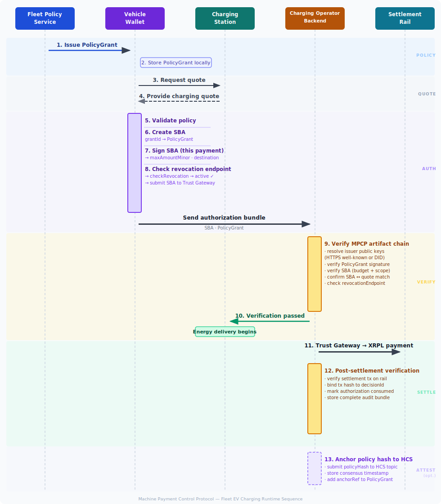

# Fleet EV Charging — MPCP Reference Flow

This document describes a **complete end‑to‑end reference scenario** for using the Machine Payment Control Protocol (MPCP) in an autonomous EV fleet charging environment.

**Chain overview:** [Authorization Chain](authorization-chain.md) — the canonical visual diagram.

The goal is to illustrate:

- who the actors are
- which MPCP artifacts are issued
- when each artifact is created
- where artifacts are stored
- how verification occurs
- how settlement is executed

This scenario is intended as a **reference implementation narrative** for developers, integrators, and auditors.

---

# Actors

See: [Actors](actors.md) for a standalone overview.

## Fleet Operator

The fleet operator owns and manages the autonomous EV fleet.

Responsibilities:

- defines vehicle payment policies
- sets spending limits
- restricts allowed vendors and locations
- issues PolicyGrant artifacts

Examples:

- robotaxi fleet
- delivery fleet
- autonomous logistics fleet

In this reference flow, the fleet operator issues signed PolicyGrant artifacts. Optionally, the fleet operator may be identified by an on-chain **[DID](https://www.w3.org/TR/did-core/)** (e.g. `did:xrpl:`, `did:hedera:`) for portable issuer identity.

## Identity & Credential Layer

This scenario optionally uses an **identity and credential layer** for issuer key discovery.

The **baseline key resolution mechanism** is HTTPS well-known:

```
https://{issuerDomain}/.well-known/mpcp-keys.json
```

This allows any MPCP verifier to look up the issuer's public key using a stable HTTPS URL without any dependency on DID infrastructure.

An optional **DID/VC layer** may supplement this in deployments that require:

- portable issuer identity across organizations
- verifiable credential metadata
- decentralized key discovery via on-chain DID methods (`did:xrpl`, `did:hedera`, `did:web`, etc.)

DIDs and VCs do **not** replace MPCP's authorization chain. The `SignedBudgetAuthorization` and the Trust Gateway remain the core runtime payment control mechanism regardless of which key resolution method is used.

## Vehicle Wallet

Each EV contains a **machine wallet** responsible for:

- enforcing MPCP policy constraints
- managing charging budgets
- issuing payment authorization artifacts
- executing settlement transactions

The wallet is the MPCP actor that signs:

- SignedBudgetAuthorization (SBA)

The wallet signs a per-payment SBA that bounds the amount and destination for each transaction. It does **not** submit XRPL payments directly — the **Trust Gateway** is the mandatory settlement actor.

The wallet also checks the fleet's **revocation endpoint** before signing each SBA. If the fleet operator has disabled the vehicle, the wallet refuses to sign, regardless of remaining budget.

---

## Route / Dispatch System

The dispatch system determines the route and charging requirements.

Responsibilities:

- determine charging locations along route
- identify approved charging networks
- provide trip metadata to the vehicle

This system may influence the **PolicyGrant** constraints.

---

## Charging Network Operator

The charging network operator manages a network of EV charging stations.

Responsibilities:

- provide price quotes
- specify settlement destination
- verify MPCP authorization artifacts
- allow or deny charging sessions

In this reference flow, the charging network operator may also publish an on-chain **[DID](https://www.w3.org/TR/did-core/)** (e.g. `did:xrpl:`, `did:hedera:`) and issue [Verifiable Credentials](https://www.w3.org/TR/vc-data-model/) describing approved station identity, operator identity, and payment endpoints.

---

## Charging Station

The physical charger interacting with the EV.

Responsibilities:

- request payment authorization from the vehicle
- relay the authorization bundle to the operator backend
- begin energy delivery once the operator backend confirms verification

Note: MPCP artifact verification is performed by the **Charging Operator Backend**, not the physical station. The station acts as a relay and executes the outcome (begin or deny charging) based on the backend's decision.

---

## Trust Gateway

The Trust Gateway is a **mandatory** actor in MPCP's XRPL profile. It:

- receives the PA-signed PolicyGrant and creates the XRPL budget escrow at grant issuance
- holds the XRPL gateway seed — no other actor submits payments on its behalf
- enforces the PA-signed `budgetMinor` as a hard ceiling across all payments in the session
- verifies each SBA before signing the XRPL Payment transaction
- attaches an `mpcp/grant-id` memo to every on-chain payment for audit traceability
- releases the escrow at grant expiry or revocation

## Settlement Rail

The settlement layer executes the payment.

In this reference flow: **XRPL + RLUSD**. Other rails (EVM, Stellar) follow the same authorization model with rail-specific escrow mechanisms.

MPCP does not replace settlement systems. It **controls authorization above them**.

---

## MPCP Verifier

The verifier checks the full authorization chain.

Verification may occur:

- inside the charging operator backend
- inside a dedicated MPCP verification service
- during post‑transaction auditing

---

# Fleet Charging Policy

Before vehicles begin operating, the fleet operator defines a charging policy.

Example constraints:

```
Allowed vendors:
    ChargeNet
    FastVolt

Allowed geography:
    Stations along active route

Allowed settlement rail:
    XRPL

Allowed asset:
    RLUSD

Daily charging limit:
    $80

Maximum single session:
    $25

Allowed charging hours:
    06:00–23:00 UTC
```

This policy is translated into a **PolicyGrant** artifact.

The PolicyGrant is issued as an MPCP-native policy artifact. In deployments using the optional DID/VC layer, it may also be wrapped or represented as a **Verifiable Credential**.

This allows the EV wallet and charging infrastructure to verify:

- who issued the policy
- which public key is authoritative
- whether the credential is still valid

---

# MPCP Artifacts Used in This Scenario

The EV charging flow uses the following MPCP artifacts.

| Artifact | Issued By | Purpose |
|--------|--------|--------|
| PolicyGrant | Fleet policy service | Defines global payment constraints, budget ceiling, escrow ref |
| SignedBudgetAuthorization | Vehicle wallet | Authorizes a specific payment (amount + destination) |
| XRPL Payment + memo | Trust Gateway | Executes on-chain settlement; tagged with `grantId` for audit |
| Settlement Result | XRPL ledger | Confirms payment execution (transaction hash) |

These artifacts form the **authorization chain**: PolicyGrant → SBA → Trust Gateway → XRPL settlement.

---

# High‑Level Sequence Diagram

The following diagram summarizes the **runtime interaction flow** between the EV, charging station, and settlement rail.



This diagram highlights the **separation of roles**:

- fleet policy authority
- vehicle runtime authorization
- charging infrastructure verification
- settlement execution

---

# Artifact Storage Matrix

The following table summarizes **where each artifact typically resides**.

| Artifact | Fleet Backend | Vehicle Wallet | Trust Gateway | Charging Operator | Settlement Rail |
|---|---|---|---|---|---|
| PolicyGrant | Authoritative copy | Operational copy | Operational copy | Optional reference | — |
| SignedBudgetAuthorization | Optional audit | Signed per payment | Received + verified | Received for verification | — |
| Settlement Result | Reconciliation | Stored receipt | Stored receipt | Stored receipt | Authoritative record |

This matrix helps implementers understand **where artifacts should be persisted and where they are transient**.

---

# Artifact Lifecycle

## PolicyGrant

Issued by:

```
Fleet Policy Service
```

Contains:

- allowed rails
- allowed assets
- vendor restrictions
- expiration time
- policy hash

Stored by:

- fleet backend
- vehicle wallet
- audit systems

The PolicyGrant is typically issued:

```
Before vehicle deployment
or
Before a trip session
```

### PolicyGrant Storage and Signature Model

A PolicyGrant is a **signed JSON authorization artifact** issued by the fleet operator's policy service.

It is **not an NFT and does not require a blockchain token**. MPCP treats the PolicyGrant as a verifiable authorization credential that can be validated using the fleet operator's public key.

Example issuer key identifiers:

```
issuer: fleet-operator.example.com          (baseline: HTTPS well-known)
issuerKeyId: fleet-policy-key-1

-- or with DID (optional; any W3C DID method) --

issuer: did:xrpl:rFleetOperator...          (example: did:xrpl)
issuerKeyId: did:xrpl:rFleetOperator...#key-1

issuer: did:hedera:mainnet:0.0.12345        (example: did:hedera)
issuerKeyId: did:hedera:mainnet:0.0.12345#key-1
```

The EV wallet resolves the public verification key using the baseline HTTPS well-known endpoint, or optionally via DID resolution.

Verification model:

```
resolve issuerKeyId
↓ (via HTTPS well-known or DID)
get issuer public key
↓
verify signature on PolicyGrant
```

This allows the EV wallet to confirm that the policy was issued by an authorized fleet authority.

Example `PolicyGrant` structure:

```json
{
  "grantId": "pg-983745",
  "policyHash": "abc123...",
  "allowedRails": ["xrpl"],
  "allowedAssets": [
    { "kind": "IOU", "currency": "RLUSD", "issuer": "rIssuer" }
  ],
  "expiresAt": "2026-03-13T23:59:00Z"
}
```

The `issuer`, `issuerKeyId`, and `signature` fields belong to the **signed envelope** that wraps the grant payload, not the grant itself.

A [Verifiable Credential (VC)](https://www.w3.org/TR/vc-data-model/) representation may also be used for issuer portability in DID/VC-enabled deployments. Any W3C-compatible DID method may appear as the `issuer`; `did:xrpl` is shown here as a concrete example.

Example conceptual VC envelope:

```
{
  "@context": ["https://www.w3.org/2018/credentials/v1"],
  "type": ["VerifiableCredential", "MPCPPolicyGrant"],
  "issuer": "did:xrpl:rFleetOperator...",   // example DID method — did:hedera, did:web, etc. also valid
  "issuanceDate": "2026-03-12T00:00:00Z",
  "expirationDate": "2026-03-13T23:59:00Z",
  "credentialSubject": {
    "actorId": "EV-847",
    "policyHash": "abc123...",
    "allowedRails": ["xrpl"],
    "vendorAllowlist": ["ChargeNet","FastVolt"],
    "capPerSessionMinor": "2500"
  },
  "proof": {
    "type": "Ed25519Signature2020",
    "verificationMethod": "did:xrpl:rFleetOperator...#key-1",
    "signature": "..."
  }
}
```

In this model, the **MPCP artifact remains canonical**, while the VC representation provides an optional identity and trust envelope.

### Where the PolicyGrant Lives

In a typical deployment the PolicyGrant exists in **three locations**:

1. **Fleet Backend (authoritative copy)**  
   Stored in the fleet operator's policy service database for auditing, policy management, and revocation tracking.

2. **Vehicle Wallet (operational copy)**  
   Stored locally in the EV wallet so the vehicle can enforce payment constraints while offline.

3. **Payment Authorization Bundle (optional)**  
   During charging authorization the EV may transmit either:
   - the full PolicyGrant, or
   - the `policyHash` reference

   allowing the charging operator to verify that the payment authorization follows the fleet policy.

If a VC form is used, the vehicle may store both:

- the canonical MPCP `PolicyGrant`
- the VC envelope containing issuer DID metadata

The runtime authorization logic should continue to use the MPCP-native artifact fields.

Example vehicle wallet storage model:

```
EV Wallet
 ├─ keys
 ├─ budgets
 ├─ paymentAuthorizations
 └─ policyGrants
       └─ grantId
           policyHash
           expiresAt
           issuer
           signature
```

The PolicyGrant can be stored in a lightweight embedded database such as:

- SQLite
- LevelDB
- secure key-value store
- encrypted filesystem

### Optional Ledger Anchoring

Some deployments may choose to anchor the `policyHash` on a public ledger for audit purposes.

Examples:

- XRPL memo
- Hedera Consensus Service
- Ethereum event log

Only the **hash of the policy** would be anchored, not the full artifact.

This provides:

- timestamped audit proofs
- dispute resolution evidence
- tamper-detection guarantees

However, anchoring is **optional** and not required for MPCP operation.

---

## SignedBudgetAuthorization

Issued by:

```
Vehicle Wallet
```

Purpose:

Define the maximum spend allowed for a session and bind that budget to permitted payment rails, assets, and destinations.

Example:

```
sessionId: charging-session-847
maxAmountMinor: 2500
currency: USD
allowedDestination:
    ChargeNet
expiresAt: session end
```

Stored by:

- vehicle wallet
- charging session bundle
- fleet audit system

---

## Trust Gateway Settlement

The Trust Gateway is responsible for submitting the XRPL Payment transaction after verifying the SBA. It does not create a separate MPCP artifact — the settlement proof is the XRPL transaction itself, tagged with an `mpcp/grant-id` memo.

The Trust Gateway tracks cumulative spend for the grant and refuses any SBA that would cause the total to exceed the PA-signed `budgetMinor`.

---

## Settlement Result

Issued by:

```
Settlement Rail
```

Examples:

- XRPL transaction
- stablecoin transfer
- payment processor receipt

Contains:

- transaction reference
- amount
- destination
- timestamp

---

# End‑to‑End Charging Timeline

## T‑24h — Fleet Policy Definition

Fleet operator defines charging policy.

The policy is converted into a **PolicyGrant**.

PolicyGrant is distributed to vehicles.

---

## T‑5m — Trip Session Begins

Vehicle receives:

- active route
- approved charging stations
- remaining daily charging budget

Vehicle prepares to issue a **SignedBudgetAuthorization** if needed.

---

## T0 — Vehicle Arrives at Charging Station

The EV connects to the charger.

Charging station sends a **payment quote**.

Example:

```
Charging estimate: $7.80
Destination: ChargeNet operator account
Quote expiry: 5 minutes
```

---

## T+10s — Vehicle Policy Validation

Vehicle checks:

- station operator is allowed vendor
- destination is allowed
- settlement rail is allowed
- asset is allowed
- amount fits session budget
- amount fits daily limit
- policy issuer public key resolves (via HTTPS well-known, or DID if configured)
- PolicyGrant signature verifies successfully

---

## T+15s — Payment Authorization

The vehicle wallet signs a **SignedBudgetAuthorization** for this payment:

```
maxAmountMinor: 780   (USD cents = $7.80)
budgetScope: SESSION
sessionId: charging-session-847
grantId: pg-983745
destinationAllowlist: [ChargeNet account]
```

The authorization bundle is sent to the charger:

- SignedBudgetAuthorization
- PolicyGrant (or reference)

---

## T+18s — Charging Operator Verification

The **charging operator backend** verifies:

1. issuer public key resolves (via Trust Bundle, HTTPS well-known, or DID)
2. PolicyGrant is valid and not expired
3. SignedBudgetAuthorization signature and constraints are valid
4. SBA `maxAmountMinor` covers the quoted amount
5. `destinationAllowlist` includes the operator's settlement address

If verification passes, the backend signals the physical charging station to begin and forwards the SBA to the Trust Gateway for settlement.

---

## T+30s — Energy Delivery Begins

The charging station begins delivering energy to the vehicle.

The payment is pre-authorized and will be settled at session end.

---

## T+N minutes — Charging Session

Energy delivery occurs.

Payment may be:

- pre‑authorized
- settled immediately
- settled at session end

---

## T+Session End — Settlement

The **Trust Gateway** submits an XRPL Payment transaction to the settlement rail:

```
XRPL payment
gateway_account → ChargeNet account
memo: mpcp/grant-id = hex(grantId)
```

The Trust Gateway:

- verifies cumulative spend for this grant does not exceed `budgetMinor`
- submits the XRPL Payment
- returns the transaction hash to the charging operator as the payment receipt

Charging operator backend then:

- verifies the XRPL transaction on-chain
- stores the transaction hash alongside the authorization bundle

---

# Multi-Merchant Shift Pattern

The timeline above describes a single charge at one station. In practice, a robotaxi or delivery vehicle makes **multiple payments across multiple merchants during a single shift** — tolls, EV charging stations, and potentially parking or access control.

MPCP handles this via an **on-vehicle wallet Session** bound to a shift-level ceiling:

```
PolicyGrant (from fleet operator, e.g. $30 shift ceiling)
    ↓
Wallet Session (scope: SESSION, ceiling: $30)
    ├─ TollExpress — Plaza Norte    $2.50   ✓  remaining $27.50
    ├─ EVGrid — ChargePoint A      $22.00   ✓  remaining $5.50
    ├─ TollExpress — Tunnel Sur     $2.50   ✓  remaining $3.00
    ├─ EVGrid — ChargePoint B      $15.00   ✗  budget exceeded (refused locally)
    └─ (grant revoked by fleet operator)
       EVGrid — ChargePoint East    $2.50   ✗  grant revoked (refused locally)
```

Each merchant verifies the SBA independently using a pre-loaded **Trust Bundle** — no server call required, no per-vehicle key configuration needed at the merchant.

Key properties of this pattern:

- **Single PolicyGrant, multiple payments** — the grant covers the entire shift; each SBA is signed per payment with a per-payment `maxAmountMinor`
- **Trust Gateway enforcement** — the gateway tracks cumulative spend and enforces the PA-signed `budgetMinor` as a hard ceiling; the on-chain escrow provides an independent upper bound
- **Trust Bundle key resolution** — pre-loaded at merchant startup; resolves the vehicle's public key by `issuer` identifier without any live network call
- **Revocation before signing** — the wallet checks the fleet's revocation endpoint before signing each SBA; a disabled vehicle cannot issue new authorizations regardless of remaining budget

This is the recommended pattern for third-party infrastructure (toll terminals, EV chargers, parking kiosks) that cannot be pre-configured with per-vehicle env keys.

---

# Data Storage Model

## Fleet Backend Stores

- fleet charging policies
- PolicyGrant history
- SignedBudgetAuthorization records
- vehicle charging audit logs
- reconciliation records

---

## Vehicle Wallet Stores

- active PolicyGrant
- per-payment SignedBudgetAuthorizations (signed, not yet submitted)
- settlement receipts (XRPL transaction hashes)

---

## Charging Operator Stores

- payment quote
- MPCP artifact bundle
- optional PolicyGrant VC / issuer DID metadata
- verification results
- settlement reference
- charging session logs

---

# Verification Points

Verification happens in several places.

## Key Resolution and Trust Model

MPCP verifiers must resolve the issuer's public key to verify signed artifacts. Three mechanisms are supported, in order of precedence:

**1. Trust Bundle (offline — preferred for fleet terminals)**

A Trust Bundle is a signed document published by the fleet operator and pre-loaded by merchants at startup. It lists the public keys of all authorized vehicles by issuer identifier.

```
sba.issuer  →  Trust Bundle issuers list  →  JWK by issuerKeyId  →  verify signature
```

No network call is required at verification time. The Trust Bundle is cached locally and refreshed periodically before expiry. Third-party infrastructure that cannot be pre-configured with per-vehicle keys (toll terminals, EV chargers, parking kiosks) SHOULD use this pattern.

**2. Baseline — HTTPS well-known:**

```
https://{issuerDomain}/.well-known/mpcp-keys.json
```

The verifier fetches the key document and looks up the key by `issuerKeyId`. Suitable when the verifier has network connectivity and the issuer domain is known.

**3. Optional — DID resolution:**

```
issuerKeyId (DID URL fragment)
      ↓
DID resolver
      ↓
DID document
      ↓
public verification key
```

When `issuerKeyId` is a DID URL fragment, the verifier may use DID resolution instead of or in addition to HTTPS well-known.

The verifier confirms:

- the signing key matches the `issuerKeyId` declared in the artifact
- the artifact signature is valid under that key

If the key cannot be resolved by any available method, the authorization should be rejected as **unverifiable**.

## Vehicle Verification

Before authorizing payment:

- destination is on the SBA `destinationAllowlist`
- settlement rail and asset are allowed
- amount is within session budget
- quote has not expired
- PolicyGrant signature is valid

---

## Charging Operator Verification

Before charging begins:

- issuer public key resolved (Trust Bundle preferred; HTTPS well-known fallback) and PolicyGrant signature is valid
- PolicyGrant not expired and constraints match
- SignedBudgetAuthorization signature and constraints are valid
- SBA `maxAmountMinor` covers the quoted amount
- SBA `destinationAllowlist` includes the operator's settlement address
- authorization not expired

---

## Fleet Reconciliation Verification

After settlement:

- settlement matches authorization
- policy constraints respected
- budgets not exceeded

---

# Failure Scenarios

## Vendor Not Allowed

Vehicle refuses to authorize payment.

---

## Quote Exceeds Budget

The vehicle wallet maintains a running spend total for the shift. Before signing an SBA, it checks:

```
cumulativeSpend + requestedAmount > shiftCeiling  →  refuse
```

If the ceiling would be exceeded, the wallet refuses to create the SBA. No authorization bundle reaches the merchant.

Example with a $30.00 shift ceiling:

| Payment | Amount | Running Total | Outcome |
|---------|--------|---------------|---------|
| TollExpress — Plaza Norte | $2.50 | $2.50 | ✓ approved |
| EVGrid — ChargePoint A | $22.00 | $24.50 | ✓ approved |
| TollExpress — Tunnel Sur | $2.50 | $27.00 | ✓ approved |
| EVGrid — ChargePoint B | $15.00 | $42.00 (> $30) | ✗ refused locally |

The refusal is local and requires no server round-trip.

---

## Destination Mismatch

Charging operator rejects authorization.

---

## Settlement Mismatch

Verifier flags payment as invalid.

---

# Audit Bundle

For audit or dispute resolution, the following bundle may be stored:

- PolicyGrant
- SignedBudgetAuthorization
- charging quote metadata
- XRPL transaction hash (settlement receipt, including `mpcp/grant-id` memo)
- optional issuer DID resolution record (when DID/VC layer is used)

This bundle allows full replay of the authorization chain.

---

# Full Artifact Bundle Example

The following example shows the kind of **self-contained authorization bundle** a charging operator could receive and store for verification, audit, or dispute replay.

This example is intentionally simplified, but it illustrates how the full MPCP authorization bundle may be packaged for audit.

> Note: SBA amounts are in USD minor units (cents). On-chain XRPL amounts are in drops or RLUSD atomic units depending on the asset.

```json
{
  "policyGrant": {
    "grantId": "pg-983745",
    "policyHash": "abc123...",
    "allowedRails": ["xrpl"],
    "allowedAssets": [
      { "kind": "IOU", "currency": "RLUSD", "issuer": "rIssuer" }
    ],
    "budgetMinor": 2500,
    "budgetEscrowRef": "xrpl:escrow:rGateway...:12345678",
    "authorizedGateway": "rGateway...",
    "offlineMaxSinglePayment": 500,
    "expiresAt": "2026-03-13T23:59:00Z"
  },

  "sba": {
    "authorization": {
      "version": "1.0",
      "budgetId": "bud-session-847",
      "grantId": "pg-983745",
      "sessionId": "charging-session-847",
      "actorId": "EV-847",
      "policyHash": "abc123...",
      "currency": "USD",
      "minorUnit": 2,
      "budgetScope": "SESSION",
      "maxAmountMinor": "780",
      "allowedRails": ["xrpl"],
      "allowedAssets": [
        { "kind": "IOU", "currency": "RLUSD", "issuer": "rIssuer" }
      ],
      "destinationAllowlist": ["rChargeNetDestination"],
      "expiresAt": "2026-03-12T15:00:00Z"
    },
    "issuer": "vehicle:EV-847.fleet.example.com",
    "issuerKeyId": "mpcp-sba-signing-key-1",
    "signature": "base64encodedSignature..."
  },

  "chargingQuote": {
    "quoteId": "quote-4421",
    "stationId": "station-17",
    "operator": "ChargeNet",
    "connectorId": "DC-FAST-2",
    "destination": "rChargeNetDestination",
    "asset": { "kind": "IOU", "currency": "RLUSD", "issuer": "rIssuer" },
    "amount": { "amount": "780000", "decimals": 6 },
    "priceFiat": { "amountMinor": "780", "currency": "USD" },
    "expiresAt": "2026-03-12T14:35:00Z"
  },

  "settlement": {
    "rail": "xrpl",
    "txHash": "ABCDEF1234...",
    "amount": "780000",
    "asset": { "kind": "IOU", "currency": "RLUSD", "issuer": "rIssuer" },
    "destination": "rChargeNetDestination",
    "submittedBy": "rGateway...",
    "memoGrantId": "pg-983745",
    "nowISO": "2026-03-12T14:31:10Z"
  }
}
```

## Notes on the Example Bundle

This bundle illustrates the canonical MPCP artifact structure:

- `policyGrant` includes `budgetMinor`, `budgetEscrowRef`, and `authorizedGateway` — the PA-signed fields that enable Trust Gateway enforcement and on-chain escrow
- `sba` uses the signed envelope format: `{ authorization: {...}, issuer, issuerKeyId, signature }` — the `authorization` object is what gets hashed and signed; `issuer` is required for Trust Bundle key resolution at offline merchants
- `sba.authorization.maxAmountMinor` = `"780"` (this payment only, in USD cents); the Trust Gateway enforces cumulative ≤ `policyGrant.budgetMinor`
- `chargingQuote` is not an MPCP artifact but is operationally important — the operator must verify that the SBA `maxAmountMinor` and `destinationAllowlist` cover the quoted amount and destination
- `settlement.txHash` is the XRPL transaction submitted by the Trust Gateway; the `mpcp/grant-id` memo links the on-chain payment to the grant for audit
- There is no SPA or SettlementIntent — the authorization chain ends at the SBA; the Trust Gateway handles all settlement parameters

In a production deployment, the exact bundle shape may vary, but it should preserve the same key property:

**a verifier must be able to reconstruct and validate the full authorization chain from policy issuance to on-chain settlement.**

Optional additions (not shown above):
- DID resolution records (when DID/VC layer is used)
- `anchorRef` on the PolicyGrant (HCS policy anchor, if the fleet operator published the policy on-chain)

# Summary

This scenario demonstrates how MPCP enables **safe autonomous charging payments**.

Runtime payment control artifacts remain lightweight and MPCP-native. Key resolution uses HTTPS well-known as the baseline, with optional DID/VC support for deployments that require portable issuer identity or verifiable credential metadata.

Infrastructure can answer the critical question:

```
Was this vehicle actually allowed to make this payment?
```

MPCP provides the cryptographic proof required to answer that question.
