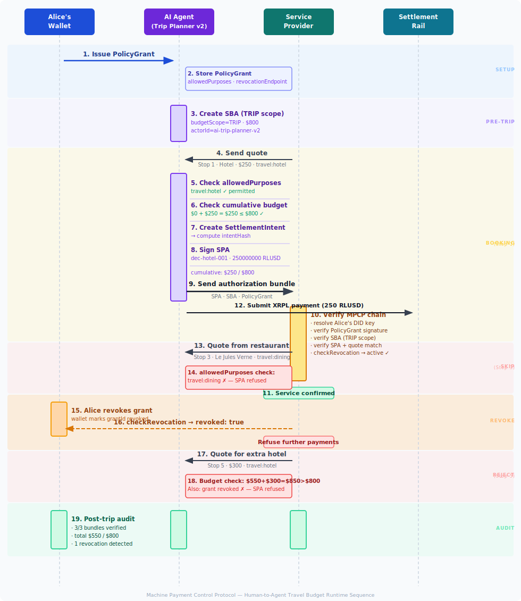

# Human-to-Agent Travel Budget — MPCP Reference Flow

This document describes a **complete end-to-end reference scenario** for using the Machine Payment Control Protocol (MPCP) in a human-to-AI-agent delegation context.

**Chain overview:** [Authorization Chain](authorization-chain.md) — the canonical visual diagram.

The goal is to illustrate:

- who the actors are
- which MPCP artifacts are issued
- when each artifact is created
- where artifacts are stored
- how verification occurs
- how the human principal retains control and can revoke mid-trip

This scenario is intended as a **reference implementation narrative** for developers, integrators, and auditors building human-to-agent payment delegation.

See also: [Human-Agent Profile](../profiles/human-agent-profile.md) for the normative profile specification.

---

# Scenario Overview

Alice is planning a 3-day trip to Paris (Apr 10–12 2026). She delegates a **$800 travel budget** to her AI trip-planning agent, which will autonomously book hotels, transport, and other services on her behalf.

Alice remains in control:

- she sets the total budget and which categories of spend are allowed
- she can revoke the delegation at any time via her wallet service
- every payment produces a cryptographically verifiable audit trail

```
Alice
  │  signs PolicyGrant (TRIP scope, $800, purposes: hotel / flight / transport)
  ▼
AI Trip Planner v2
  │  enforces allowedPurposes + cumulative budget
  │  issues SBA (TRIP scope) once per trip
  │  issues SPA per service provider
  ▼
Service Providers (hotel, rail, car rental)
  │  verify MPCP authorization chain
  │  provide service on confirmation
  ▼
Settlement Rail (XRPL / RLUSD)
```

---

# Actors

See: [Actors](actors.md) for a standalone overview.

## Human Principal (Alice)

Alice is a human user who owns the payment budget and sets spending policy.

Responsibilities:

- defines the travel budget and constraints via a **PolicyGrant**
- signs the PolicyGrant with her DID key
- optionally anchors the policy to Hedera HCS for audit
- can revoke the delegation mid-trip via her wallet service's revocation endpoint

Alice's identity is expressed as a **DID** (`did:key:...` or `did:xrpl:...`). The PolicyGrant `issuer` field contains her DID; her public key is used to verify all PolicyGrant signatures.

In this reference flow:

```
issuer:    did:key:z6MkhaXgBZDvotDkL5257faiztiGiC2QtKLGpbnnEGta2doK
issuerKeyId: alice-did-key-1
```

Alice's wallet service hosts the revocation endpoint at:

```
https://wallet.alice.example.com/revoke
```

---

## AI Agent (AI Trip Planner v2)

The AI agent acts as Alice's authorized payment delegate for the duration of the trip.

Responsibilities:

- enforces `allowedPurposes` — refuses to sign SPAs for merchant categories not permitted in the PolicyGrant
- tracks cumulative spend across all sessions within the TRIP scope
- issues a **SignedBudgetAuthorization (SBA)** with `budgetScope: "TRIP"` that covers the full trip
- issues a **SignedPaymentAuthorization (SPA)** for each approved service
- checks revocation status before each payment

The agent uses `actorId` as its identity in MPCP artifacts (the field generalizes to any autonomous payment actor):

```
actorId: ai-trip-planner-v2
```

The agent holds two signing keys:

- **SBA key** (`agent-sba-key-1`) — authorizes the trip budget
- **SPA key** (`agent-spa-key-1`) — authorizes each individual payment

---

## Service Providers

Service providers supply accommodation, transport, and other travel services.

In this scenario:

| Stop | Provider | Purpose | Amount |
|------|----------|---------|--------|
| 1 | Mercure Paris (hotel) | travel:hotel | $250 |
| 2 | Eurostar (rail) | travel:flight | $120 |
| 3 | Le Jules Verne (restaurant) | travel:dining | — (skipped) |
| 4 | Europcar (car rental) | travel:transport | $180 |
| 5 | Hotel extra night | travel:hotel | $300 (rejected) |

Responsibilities:

- send a payment quote to the AI agent
- receive and verify the MPCP authorization bundle (PolicyGrant, SBA, SPA)
- optionally check revocation status at `revocationEndpoint`
- provide the service once verification passes

---

## Settlement Rail

The settlement layer executes the payment.

In this scenario:

- **Rail**: XRPL
- **Asset**: RLUSD (IOU, 6 decimal places)
- **Settlement model**: per-service payment at time of booking confirmation

MPCP does not replace the settlement rail. It **controls authorization above it**.

---

## MPCP Verifier

The verifier checks the full authorization chain.

In this scenario the verifier runs at the service provider's backend (or an MPCP-aware proxy). It checks:

- PolicyGrant signature (Alice's DID key)
- SBA signature and TRIP scope budget constraints
- SPA signature and payment parameters

Verification may also occur during post-trip auditing using the stored artifact bundles.

---

# Key Concepts

## TRIP Scope

The SBA `budgetScope` field is set to `"TRIP"`, indicating the budget covers **multiple sessions across multiple days**. This contrasts with `"SESSION"` scope used in single-session flows (e.g., fleet EV charging).

The AI agent is responsible for tracking cumulative spend across all individual bookings. The TRIP budget is not enforced per-session but across the entire delegation window.

```
budgetScope: "TRIP"
maxAmountMinor: "80000"   // $800.00 (USD minor units = cents)
```

## allowedPurposes

The PolicyGrant includes an `allowedPurposes` field restricting which merchant categories the agent may pay:

```json
"allowedPurposes": ["travel:hotel", "travel:flight", "travel:transport"]
```

The agent **refuses to sign an SPA** for any service whose purpose falls outside this list. In this scenario, Stop 3 (restaurant `travel:dining`) is silently refused — no SBA check, no payment, no exception propagated to the provider.

This gives Alice fine-grained categorical control beyond just the total budget.

## revocationEndpoint

The PolicyGrant includes a `revocationEndpoint` where any service provider or the agent itself can check whether Alice has cancelled the delegation:

```
revocationEndpoint: https://wallet.alice.example.com/revoke
```

The revocation check is **online** and performed at the service provider's discretion before confirming service. The MPCP verifier itself remains stateless — revocation is a separate application-layer check layered on top.

When `checkRevocation(endpoint, grantId)` returns `{ revoked: true }`, service providers should refuse further payments against that grant.

---

# High-Level Sequence Diagram

The following diagram summarizes the **runtime interaction flow** between Alice's wallet, the AI agent, service providers, and the settlement rail.



This diagram highlights the **separation of roles**:

- human principal (Alice) controls policy and revocation
- AI agent enforces allowedPurposes and cumulative budget
- service providers verify the authorization chain
- settlement rail executes payment

---

# MPCP Artifacts Used in This Scenario

| Artifact | Issued By | Purpose |
|----------|-----------|---------|
| PolicyGrant | Alice (human principal, DID key) | Defines budget, purposes, revocation endpoint |
| SignedBudgetAuthorization | AI Agent (SBA key) | Authorizes $800 TRIP budget |
| SignedPaymentAuthorization | AI Agent (SPA key) | Authorizes each individual service payment |
| SettlementIntent | AI Agent | Defines settlement parameters for each payment |
| Settlement Result | Settlement rail | Confirms payment execution |

These artifacts form the **authorization chain** from human principal to on-chain settlement.

---

# Artifact Storage Matrix

| Artifact | Alice's Wallet | AI Agent | Service Provider | Settlement Rail |
|----------|---------------|----------|-----------------|-----------------|
| PolicyGrant | Authoritative copy | Operational copy | Received for verification | — |
| SBA | Optional audit | Active trip artifact | Received in bundle | — |
| SPA | Optional audit | Issued per stop | Received and verified | — |
| SettlementIntent | Optional audit | Runtime artifact | Optional | — |
| Settlement Result | Reconciliation | Stored receipt | Stored receipt | Authoritative record |

---

# Artifact Lifecycle

## PolicyGrant

Issued by:

```
Alice (human principal, DID key)
```

Contains:

- allowed rails and assets
- spending scope (TRIP)
- total budget (via associated policy document / policyHash)
- allowed purposes (merchant category filter)
- revocation endpoint
- expiry time

Stored by:

- Alice's wallet (authoritative)
- AI agent (operational copy)
- service providers (received per authorization bundle)

The PolicyGrant is issued **before the trip** and covers the entire trip duration.

### PolicyGrant Signature Model

A PolicyGrant is a **signed JSON authorization artifact** signed by Alice's DID key.

```
issuer: did:key:z6MkhaXgBZDvotDkL5257faiztiGiC2QtKLGpbnnEGta2doK
issuerKeyId: alice-did-key-1
```

Key resolution: service providers and verifiers resolve Alice's DID to retrieve her public verification key. For `did:key` DIDs, the key material is embedded in the DID itself. For `did:xrpl` DIDs, resolution uses the XRPL `account_objects` JSON-RPC call.

Example `PolicyGrant` structure:

```json
{
  "grantId": "pg-alice-paris-2026",
  "policyHash": "a1b2c3d4e5f6",
  "allowedRails": ["xrpl"],
  "allowedAssets": [
    { "kind": "IOU", "currency": "RLUSD", "issuer": "rIssuer" }
  ],
  "allowedPurposes": ["travel:hotel", "travel:flight", "travel:transport"],
  "revocationEndpoint": "https://wallet.alice.example.com/revoke",
  "expiresAt": "2026-04-13T00:00:00Z"
}
```

The `issuer`, `issuerKeyId`, and `signature` fields belong to the signed envelope that wraps the grant payload.

### Optional On-Chain Policy Anchoring

Alice may optionally anchor the policy document to Hedera Consensus Service at issuance time. This produces an `anchorRef` field on the PolicyGrant:

```
anchorRef: "hcs:0.0.12345:42"
```

The anchor provides a tamper-evident, timestamped record of the policy on a public ledger. Any third party can verify that the policy document was published before the trip began.

See: [Policy Anchoring](../protocol/policy-anchoring.md) for details.

---

## SignedBudgetAuthorization (TRIP scope)

Issued by:

```
AI Agent (SBA key)
```

The SBA is issued **once for the entire trip** before the first service booking. It covers all stops within the delegation window.

```
budgetScope: TRIP
maxAmountMinor: "80000"   ($800.00)
sessionId: paris-trip-2026-alice
actorId: ai-trip-planner-v2
destinationAllowlist: [rHotelMercureParis, rEurostar, rEuropcarParis]
```

The agent tracks cumulative spend internally; each SPA reduces the remaining available budget.

Stored by:

- AI agent (active trip artifact)
- service provider authorization bundle
- Alice's audit log (optional)

---

## SettlementIntent

Issued by:

```
AI Agent
```

Created per booking, after the service provider sends a quote.

Contains:

- rail
- asset
- destination
- amount (atomic units)
- timestamp

An **intentHash** (SHA-256 of the SettlementIntent) may be included in the SPA for tamper-evident binding.

---

## SignedPaymentAuthorization (SPA)

Issued by:

```
AI Agent (SPA key)
```

Issued per service booking. Authorizes a specific payment amount to a specific destination.

Contains:

- session reference
- settlement parameters (rail, asset, amount, destination)
- intentHash (optional)
- decisionId
- signature

Stored by:

- AI agent
- service provider
- audit log

---

## Settlement Result

Issued by:

```
Settlement Rail (XRPL)
```

Produced when the XRPL payment transaction executes.

Contains:

- transaction hash
- amount
- destination
- timestamp

---

# End-to-End Trip Timeline

## T-48h — Alice Issues PolicyGrant

Alice's wallet generates the delegation:

```
principal:          Alice
did:                did:key:z6MkhaXgBZDvotDkL5257faiztiGiC2QtKLGpbnnEGta2doK
budget:             $800 TRIP scope
rail:               XRPL / RLUSD
allowedPurposes:    travel:hotel, travel:flight, travel:transport
revocationEndpoint: https://wallet.alice.example.com/revoke
expires:            2026-04-13T00:00:00Z
```

The PolicyGrant is signed with Alice's DID key and delivered to the AI agent.

Optionally: Alice's wallet anchors the policy document to HCS and stores the `anchorRef` in the grant.

---

## T-1h — Agent Pre-loads SBA

The AI agent issues a **SignedBudgetAuthorization** for the full trip before any bookings begin.

```
budgetScope:         TRIP
maxAmountMinor:      "80000"   ($800.00)
sessionId:           paris-trip-2026-alice
actorId:           ai-trip-planner-v2
grantId:             pg-alice-paris-2026
destinationAllowlist: [rHotelMercureParis, rEurostar, rEuropcarParis]
expiresAt:           2026-04-13T00:00:00Z
```

This SBA is included in every subsequent authorization bundle.

---

## Apr 10 — Stop 1: Hotel (Mercure Paris)

### Provider sends quote

```
provider:     Mercure Paris
purpose:      travel:hotel
amount:       $250.00
destination:  rHotelMercureParis
quoteId:      q-hotel-001
```

### Agent validates

- purpose `travel:hotel` is in `allowedPurposes` — permitted
- cumulative spend: $0 + $250 = $250 ≤ $800 — within budget
- destination `rHotelMercureParis` is on SBA `destinationAllowlist`

### Agent issues SPA

```
decisionId:   dec-hotel-001
amount:       250000000 RLUSD (6 decimals)
destination:  rHotelMercureParis
```

### Provider verifies

1. Resolves Alice's DID key
2. Verifies PolicyGrant signature
3. Confirms `travel:hotel` is in `allowedPurposes`
4. Verifies SBA signature and TRIP budget
5. Verifies SPA signature and parameters match quote
6. Checks revocation: `{ revoked: false }` → grant active

Service confirmed. Settlement executes on XRPL.

**Cumulative: $250 / $800**

---

## Apr 11 — Stop 2: Eurostar Tickets

### Provider sends quote

```
provider:     Eurostar
purpose:      travel:flight
amount:       $120.00
destination:  rEurostar
quoteId:      q-train-001
```

### Agent validates

- purpose `travel:flight` is in `allowedPurposes` — permitted
- cumulative spend: $250 + $120 = $370 ≤ $800 — within budget
- destination `rEurostar` is on SBA `destinationAllowlist`

### Agent issues SPA

```
decisionId:   dec-train-001
amount:       120000000 RLUSD
destination:  rEurostar
```

### Provider verifies and confirms

Service confirmed. Settlement executes on XRPL.

**Cumulative: $370 / $800**

---

## Apr 11 — Stop 3: Restaurant (Le Jules Verne) — SKIPPED

### Provider sends quote

```
provider:   Le Jules Verne
purpose:    travel:dining
amount:     ~$180
```

### Agent refuses without issuing SPA

The agent checks `policyGrant.allowedPurposes`:

```
allowedPurposes: [travel:hotel, travel:flight, travel:transport]
```

`travel:dining` is not in the list. The agent **refuses to sign an SPA**. No SBA check, no payment, no settlement.

The service provider receives no authorization artifact.

---

## Apr 11 (mid-trip) — Alice Revokes

Alice decides to cancel the remainder of the delegation.

Her wallet service marks the grant as revoked:

```
grantId:   pg-alice-paris-2026
revokedAt: 2026-04-11T18:30:00Z
```

The revocation endpoint at `https://wallet.alice.example.com/revoke` now returns:

```json
{ "revoked": true, "revokedAt": "2026-04-11T18:30:00Z" }
```

Any subsequent `checkRevocation(endpoint, grantId)` call returns `{ revoked: true }`.

---

## Apr 12 — Stop 4: Car Rental (Europcar)

The car rental booking was made **before** Alice revoked (workflow pre-authorization). The agent had pre-authorized this booking in an earlier session before revocation occurred. The settlement executes on Apr 12 against the existing SPA.

> Note: In implementations that check revocation at settlement time (not just at authorization time), this booking would be blocked. The reference flow assumes the SPA was issued before revocation and settlement completes.

```
provider:   Europcar Paris
purpose:    travel:transport
amount:     $180.00
destination: rEuropcarParis
```

Settlement executes. **Cumulative: $550 / $800**

---

## Apr 12 — Stop 5: Extra Hotel Night — REJECTED

The agent attempts to book an additional hotel night ($300) but checks cumulative spend:

```
$550 + $300 = $850 > $800 budget
```

The agent refuses to sign the SPA. Payment is refused.

The agent also checks revocation:

```
checkRevocation() → { revoked: true }
```

Even if the budget were available, the revoked grant would prevent new authorizations.

---

# Post-Trip Audit

All three settled bundles (hotel, Eurostar, car rental) can be independently verified after the trip using the stored artifact bundles.

Each bundle contains:

- PolicyGrant (Alice's signed delegation)
- SBA (TRIP-scope trip authorization)
- SPA (individual booking authorization)
- SettlementIntent
- Settlement result

Any auditor with Alice's public key can reconstruct and verify the full authorization chain.

---

# Data Storage Model

## Alice's Wallet

- PolicyGrant (authoritative)
- revocation state
- optional: trip audit log

---

## AI Agent Stores

- active PolicyGrant
- active SBA (TRIP scope)
- issued SPAs (per booking)
- SettlementIntents
- settlement receipts
- cumulative spend tracker

---

## Service Provider Stores

- payment quote
- received authorization bundle (PolicyGrant + SBA + SPA)
- verification result
- settlement reference
- booking record

---

# Verification Points

## Key Resolution and Trust Model

Service providers verify the PolicyGrant signature using Alice's DID public key.

For `did:key` DIDs, the public key is derived directly from the DID string — no network call required.

For `did:xrpl` DIDs, the verifier calls the XRPL `account_objects` JSON-RPC to retrieve the DIDObject and extract the JWK public key.

```
issuerKeyId (Alice's DID)
      ↓
DID resolver (did:key — inline; did:xrpl — XRPL JSON-RPC)
      ↓
public verification key
      ↓
verify PolicyGrant signature
```

## Agent Verification (before issuing SPA)

Before signing each SPA, the agent checks:

- `allowedPurposes` contains the service purpose
- cumulative spend + this payment ≤ `maxAmountMinor`
- destination is on SBA `destinationAllowlist`
- settlement rail and asset are allowed
- PolicyGrant is not expired
- revocation status via `revocationEndpoint`

---

## Service Provider Verification

Before confirming service:

1. resolve Alice's DID key and verify PolicyGrant signature
2. PolicyGrant not expired; `allowedPurposes` includes the requested category
3. SBA signature valid; TRIP budget sufficient
4. SPA signature valid; payment parameters match the quote
5. check `revocationEndpoint` (optional but recommended)

---

## Post-Trip Audit Verification

After trip:

- each bundle independently verifiable
- settlement amounts match SPA amounts
- cumulative spend within TRIP budget
- no SPAs issued for revoked grant (post-revocation-timestamp check)

---

# Failure Scenarios

## Purpose Not Allowed

Agent refuses to issue SPA. Service provider receives no authorization. No payment.

---

## Budget Exceeded

Agent checks cumulative spend before signing SPA. If `cumulative + amount > maxAmountMinor`, agent refuses. No SPA, no payment.

---

## Grant Revoked

`checkRevocation()` returns `{ revoked: true }`. Agent refuses further SPAs. Service provider rejects authorization bundle.

---

## PolicyGrant Expired

Service provider rejects authorization (expired grant). Agent should not issue new SPAs against an expired grant.

---

## Destination Not on Allowlist

SBA `destinationAllowlist` does not include the destination. Agent refuses to sign SPA.

---

## Signature Verification Failure

DID resolution fails or PolicyGrant/SBA/SPA signature is invalid. Service provider rejects the bundle.

---

# Audit Bundle

For audit or dispute resolution, the following bundle may be stored per service booking:

- PolicyGrant (Alice's signed delegation)
- SBA (TRIP-scope authorization)
- SPA (booking-specific authorization)
- SettlementIntent
- Payment quote metadata
- Settlement receipt (XRPL transaction hash)
- Optional: revocation check result at time of authorization
- Optional: anchorRef (HCS policy anchor, if Alice published the policy on-chain)

This bundle allows full replay of the authorization chain from Alice's delegation to on-chain settlement.

---

# Full Artifact Bundle Example

The following example shows the self-contained authorization bundle for Stop 1 (Hotel Mercure Paris).

This illustrates the TRIP-scoped delegation chain: Alice → AI Agent → Hotel → XRPL settlement.

> Amounts are in atomic units. `"250000000"` represents 250.00 RLUSD with 6 decimal places (XRPL IOU convention).

```json
{
  "policyGrant": {
    "grantId": "pg-alice-paris-2026",
    "policyHash": "a1b2c3d4e5f6",
    "allowedRails": ["xrpl"],
    "allowedAssets": [
      { "kind": "IOU", "currency": "RLUSD", "issuer": "rIssuer" }
    ],
    "allowedPurposes": ["travel:hotel", "travel:flight", "travel:transport"],
    "revocationEndpoint": "https://wallet.alice.example.com/revoke",
    "expiresAt": "2026-04-13T00:00:00Z",
    "issuer": "did:key:z6MkhaXgBZDvotDkL5257faiztiGiC2QtKLGpbnnEGta2doK",
    "issuerKeyId": "alice-did-key-1",
    "signature": "base64encodedAliceSignature..."
  },

  "sba": {
    "authorization": {
      "version": "1.0",
      "budgetId": "bud-paris-trip-2026",
      "grantId": "pg-alice-paris-2026",
      "sessionId": "paris-trip-2026-alice",
      "actorId": "ai-trip-planner-v2",
      "policyHash": "a1b2c3d4e5f6",
      "currency": "USD",
      "minorUnit": 2,
      "budgetScope": "TRIP",
      "maxAmountMinor": "80000",
      "allowedRails": ["xrpl"],
      "allowedAssets": [
        { "kind": "IOU", "currency": "RLUSD", "issuer": "rIssuer" }
      ],
      "destinationAllowlist": [
        "rHotelMercureParis",
        "rEurostar",
        "rEuropcarParis"
      ],
      "expiresAt": "2026-04-13T00:00:00Z"
    },
    "issuerKeyId": "agent-sba-key-1",
    "signature": "base64encodedSbaSignature..."
  },

  "settlementIntent": {
    "version": "1.0",
    "rail": "xrpl",
    "amount": "250000000",
    "destination": "rHotelMercureParis",
    "asset": { "kind": "IOU", "currency": "RLUSD", "issuer": "rIssuer" },
    "createdAt": "2026-04-10T15:00:00Z"
  },

  "spa": {
    "authorization": {
      "version": "1.0",
      "decisionId": "dec-hotel-001",
      "sessionId": "paris-trip-2026-alice",
      "policyHash": "a1b2c3d4e5f6",
      "budgetId": "bud-paris-trip-2026",
      "quoteId": "q-hotel-001",
      "rail": "xrpl",
      "asset": { "kind": "IOU", "currency": "RLUSD", "issuer": "rIssuer" },
      "amount": "250000000",
      "destination": "rHotelMercureParis",
      "intentHash": "sha256ofSettlementIntent...",
      "expiresAt": "2026-04-13T00:00:00Z"
    },
    "issuerKeyId": "agent-spa-key-1",
    "signature": "base64encodedSpaSignature..."
  },

  "settlement": {
    "rail": "xrpl",
    "amount": "250000000",
    "asset": { "kind": "IOU", "currency": "RLUSD", "issuer": "rIssuer" },
    "destination": "rHotelMercureParis",
    "nowISO": "2026-04-10T15:00:00Z"
  }
}
```

## Notes on the Example Bundle

- `policyGrant.issuer` is Alice's DID — the human principal who signed the delegation
- `sba.authorization.budgetScope` is `"TRIP"` — the budget covers the full 3-day trip, not just this session
- `sba.authorization.actorId` is the AI agent identifier — the `actorId` field generalizes to any autonomous payment actor, not just vehicles
- `spa.authorization.budgetId` links to `sba.authorization.budgetId` — tying the payment to the trip-level budget
- `policyGrant.allowedPurposes` is enforced by the agent before signing any SPA — the hotel (`travel:hotel`) is permitted; the restaurant (`travel:dining`) would not be
- amounts are in atomic units: `"250000000"` = 250.00 RLUSD with 6 decimal places

## Differences from Fleet EV Charging Bundle

| Dimension | Fleet EV | Human-Agent Trip |
|-----------|----------|-----------------|
| PolicyGrant issuer | Fleet Operator (organization) | Alice (individual, DID key) |
| SBA budgetScope | SESSION (single charge) | TRIP (multi-day, multi-session) |
| Spend enforcement | Per-session by SBA | Cumulative across trip, by agent |
| allowedPurposes | Not typically used | Core control mechanism |
| Revocation | Optional | Designed in (human can cancel) |
| Key resolution | HTTPS well-known or DID | DID (human identity) |

---

# Summary

This scenario demonstrates how MPCP enables **safe human-to-AI-agent payment delegation**.

Alice retains meaningful control throughout:

- the PolicyGrant defines exactly which categories of spend are permitted
- the TRIP budget is enforced cumulatively across all bookings
- revocation is available at any time via Alice's wallet service

Service providers can cryptographically verify that every payment was authorized by Alice — even when the immediate counterparty is an AI agent acting autonomously.

The critical audit question is the same as in all MPCP deployments:

```
Was this payment actually authorized by the human principal?
```

MPCP provides the cryptographic proof required to answer that question — from Alice's DID-signed PolicyGrant through to XRPL settlement.
