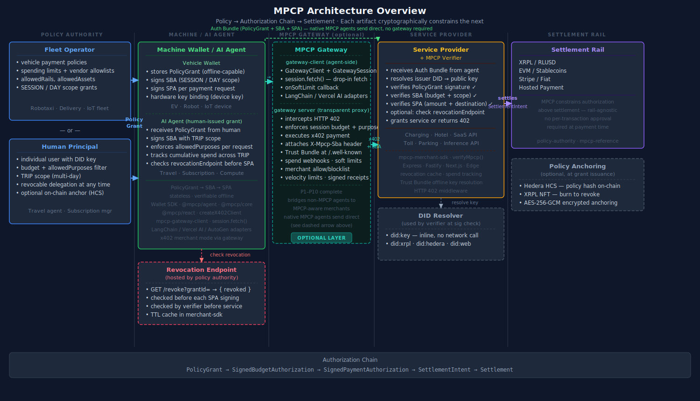

# System Model

MPCP models machine payments as a **cryptographic authorization chain** that sits above settlement rails.

## Overview

The system model has three layers:

| Layer | Role | Examples |
|-------|------|----------|
| **Policy** | Defines spending rules | Fleet operator policy, vendor allowlists, caps |
| **Authorization** | Bounds runtime spending | PolicyGrant, SBA |
| **Settlement** | Executes payment | XRPL, EVM, Stripe, hosted |

MPCP operates in the **authorization** layer. It does not replace or implement the settlement layer—it constrains what may be settled.

The canonical flow is: **PolicyGrant → SignedBudgetAuthorization (SBA) → Trust Gateway → XRPL Settlement**.

→ [Authorization Chain (visual diagram)](authorization-chain.md)

## Trust Model

- **Policy issuer** — Authority that defines rules (fleet operator, service operator)
- **Machine wallet** — Signs SBAs within policy bounds
- **Trust Gateway** — Verifies the authorization chain, enforces the PA-signed budget ceiling, submits XRPL payment
- **Verifier** — Validates the chain before allowing service or settlement
- **Settlement rail** — Executes the actual payment (XRPL in v1.0)

Each step produces verifiable artifacts. The verifier can independently validate the full chain without trusting any single party.

## Key Properties

1. **Decoupled** — Policy, budget, and settlement are separate concerns
2. **Verifiable** — Settlement can be checked against authorization chain; on-chain via `mpcp/grant-id` memo
3. **Offline-capable** — Machine holds chain onboard; offline merchants verify locally via Trust Bundle
4. **XRPL-primary** — v1.0 profile uses XRPL escrow + RLUSD; other rails supported via future profiles

## See Also

- [Authorization Chain](authorization-chain.md) — The canonical visual diagram
- [Actors](actors.md)
- [Artifact Lifecycle](artifact-lifecycle.md)
- [Reference Flow](fleet-ev-reference-flow.md)
